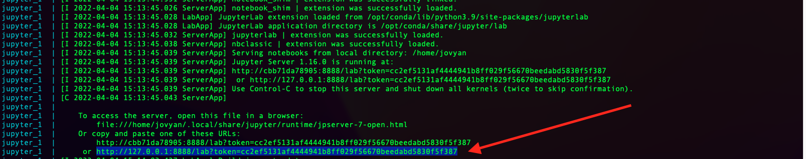
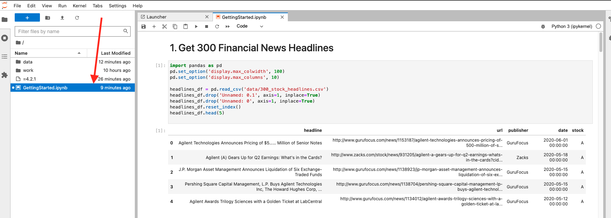

# financial-news

# Clone the Repo 
```
git clone https://github.com/RedisAI/financial-news.git
```
# Fire Up the Docker containers
Use docker-compose to start up 2 containers:
* vesim: A redis container with Vector Similarity Search (VSS Private Preview) on port 6379
* jupyter: A python notebook server on port 8888
    
```
cd financial-news
docker-compose up
```
**NOTE**: The first time you run the above command, it will take 5-10 minutes (depending on your network)

# Launch the Jupyter Notebook
Monitor the logs 

Look out for the link to launch jupyter on your local machine



Open a browser to this link



Run All Cells and check the outputs

